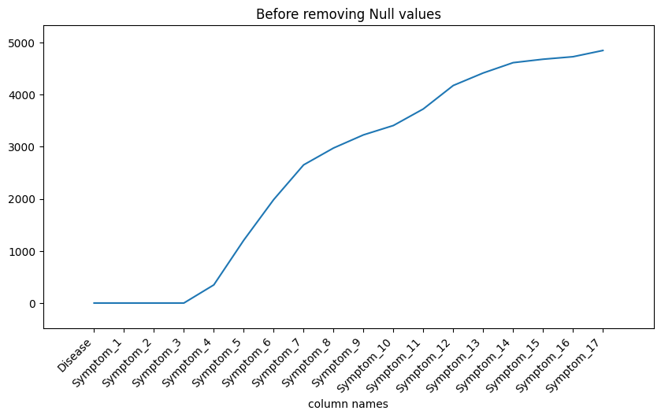
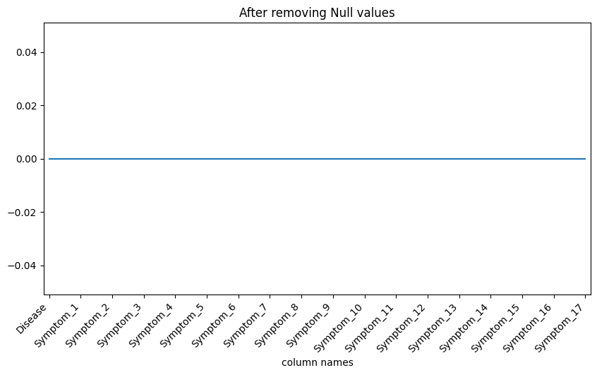
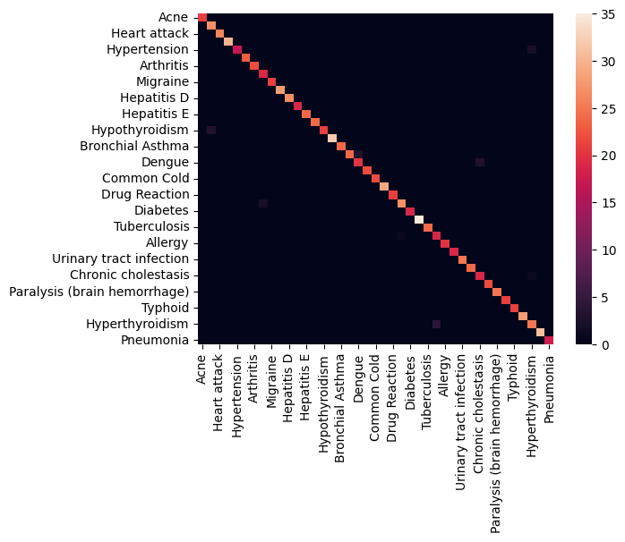
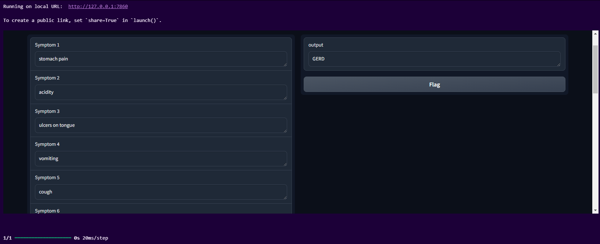

# Disease Prediction from Medical Data

This project is focused on **predicting diseases** using a machine learning model trained on medical data. It leverages features like patient symptoms, diagnostic information, and medical history to classify diseases accurately. The project includes data preprocessing, model training, evaluation, and visualization of results.

## Table of Contents
1. [Overview](#overview)
2. [Project Setup](#project-setup)
3. [Dataset](#dataset)
4. [Model Architecture](#model-architecture)
5. [Results](#results)
6. [Usage](#usage)
7. [Contributing](#contributing)
8. [License](#license)
9. [Acknowledgments](#acknowledgments)

## Overview
The **Disease Prediction from Medical Data** model predicts the most likely disease based on patient information and symptoms. It uses machine learning techniques to analyze the input data and classify the disease with high accuracy.

### GitHub Repository: [Disease Prediction from Medical Data](https://github.com/AryanMithbawkar/Disease-Prediction-from-Medical-Data)

## Project Setup

### Requirements
To install the required libraries, run the following command:

```bash
pip install -r requirements.txt
```

## Libraries used:
+ Python 3.7+
+ TensorFlow/Keras
+ Scikit-learn
+ Pandas
+ NumPy
+ Matplotlib
+ Seaborn

## Folder Structure
```bash
├── dataset
├── output1.png
├── output2.png
├── output3.png
├── output4.png
├── disease-prediction.ipynb
└── README.md
```
## Dataset
The dataset includes patient information such as:

+ Symptoms (e.g., fever, cough, nausea)
+ Diagnostic tests (e.g., blood pressure, glucose levels)
+ Medical history (e.g., chronic conditions, previous diagnoses)
Each record in the dataset maps a set of medical conditions to a diagnosed disease. The data is cleaned, preprocessed, and encoded to be used in the machine learning model.

## Data Preprocessing:
+ **Handling Missing Values**: Imputed missing data using the median for numeric columns and the mode for categorical columns.
+ **Label Encoding**: Converted categorical data (like symptoms) into numerical format.

## Data Visualization:
+ distribution of null values in columns:
    - 
    - 

## Model Architecture
The disease prediction model is a Deep Neural Network (DNN), designed to classify diseases based on the input data. It has multiple layers for feature extraction and classification.
+ Architecture:
  - Input Layer: Receives features from the medical dataset.
  - Hidden Layers: Multiple layers with ReLU activation and l2(Ridge) regulizer for learning complex patterns in the data.
  - Output Layer: A softmax layer for predicting disease categories.
```python
ann_model = Sequential()
ann_model.add(tf.keras.Input(shape=(x_train.shape[1],)))
ann_model.add(Dense(units=100, activation='relu',kernel_regularizer=regularizers.l2(0.0001)))
ann_model.add(Dense(units=50, activation='relu',kernel_regularizer=regularizers.l2(0.0001)))
ann_model.add(Dense(units=len(df['Disease'].unique()), activation='softmax',kernel_regularizer=regularizers.l2(0.0001)))
```

## Model Summary:

+ Training: The model is trained using a combination of cross-entropy loss and Adam optimizer, with accuracy as the primary evaluation metric.

## Results
The model achieved high accuracy in predicting diseases from patient medical data. Here are some key results:

+ Accuracy: 98.06%
+ F1-Score: 98.04% (macro average)

## Confusion Matrix:
The confusion matrix provides insight into the model's performance across different diseases:


## Usage
To use this project for disease prediction:

1. Clone the repository:
```bash
git clone https://github.com/AryanMithbawkar/Disease-Prediction-from-Medical-Data
```
2. Run the Jupyter Notebook:
```bash
jupyter notebook disease-prediction.ipynb
```
3. Train the model or use the pre-trained model for disease prediction.
4. you can use the Gradio Interface for easy input and prediction:
```python
import gradio as gr
inputs = [gr.Textbox(placeholder="Symptom", label=f"Symptom {i+1}") for i in range(17)]

interface = gr.Interface(
    fn=gradio_predict,
    inputs=inputs,
    outputs="text",
    title="Disease Prediction Based on Symptoms",
    description="Enter symptoms to predict the most likely disease. Each input field can accept one symptom."
)

# Launch the Gradio interface
interface.launch()
```


## Using the Pre-trained Model
You can use the pre-trained model to predict diseases by loading it and passing medical data as input.
```python
from tensorflow.keras.models import load_model
model = load_model('model/disease_prediction_model.h5')

def predict_single(symptoms_list):
    # Create a DataFrame from the input symptoms
    input_data = pd.DataFrame([symptoms_list], columns=symptoms_list)
    
    # Convert input symptoms to weights using the symptom severity CSV
    encoded_input = []
    for symptom in symptoms_list:
        if symptom in df1['Symptom'].values:
            encoded_input.append(df1[df1['Symptom'] == symptom]['weight'].values[0])
        else:
            encoded_input.append(0)  # If symptom is not found, treat it as zero
    
    # Convert the list to a numpy array (similar to the input data shape)
    input_array = np.array(encoded_input).reshape(1, -1)
    
    # Pad the input array to match the number of columns in the training set (if needed)
    if input_array.shape[1] < x_train.shape[1]:
        padded_input = np.zeros((1, x_train.shape[1]))
        padded_input[:, :input_array.shape[1]] = input_array
    else:
        padded_input = input_array

    # Predict the disease
    prediction_probs = ann_model.predict(padded_input)
    predicted_class = np.argmax(prediction_probs, axis=1)
    predicted_disease = label_encoder.inverse_transform(predicted_class)[0]
    
    return predicted_disease)
symptomss = ['vomiting', 'yellowish skin', 'abdominal pain', 'swelling of stomach', 'distention of abdomen', 'history of alcohol consumption', 'fluid overload']
predicted_disease = predict_single(symptomss)
print(f"Predicted Disease: {predicted_disease}")
```
## Contributing
We welcome contributions from the community. If you’d like to contribute, feel free to open an issue or submit a pull request.

1. Fork the repository
2. Create a new branch for your feature
3. Submit a pull request for review

## License
This project is licensed under the MIT License. See the LICENSE file for more details.

## Acknowledgments
+ TensorFlow/Keras: For providing the framework to build the model.
+ Kaggle: For providing medical datasets and resources.
+ Matplotlib & Seaborn: For visualizations.
